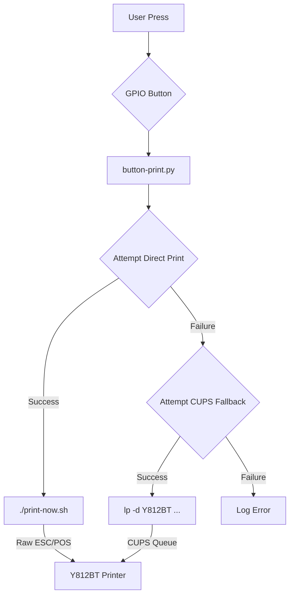

# Burning Man Thermal Printer System
**Button-triggered haiku printing at the playa** ⚡🖨️🏜️

## Overview
Y812BT thermal printer controlled via GPIO button on Raspberry Pi. Prints haikus and dadaist hyperstitions on demand.

## Quick Start
```bash
# Start GPIO button daemon
python3 button-print.py

# Manual printing
./print-now.sh
lp -d Y812BT haiku.txt
```

## System Components

### Hardware
- **Y812BT thermal printer** (USB 5958:0130)
- **GPIO button** on pin 6
- **Raspberry Pi** with adequate power supply

### Software Stack
- `button-print.py` - GPIO daemon with dual-method printing
- `print-now.sh` - Direct ESC/POS device commands
- `haiku.txt` - Original zen content
- `dada_hyperstition.txt` - Glitch-reality ASCII art
- `runtime_status.json` - System activity tracking

### Print Methods
1. **Direct device**: Raw ESC/POS → `/dev/usb/lp0`
2. **CUPS fallback**: Standard print queue system

## Content Library
- **Zen haiku**: "Context distilled, clear..."
- **Dadaist hyperstition**: Reality.exe crashes & machine dreams
- **ASCII art**: Thermal-optimized glitch aesthetics

## Status: All Systems Operational ✅
- Hardware connected & accessible
- Dual print methods verified
- GPIO monitoring active
- User permissions configured

## System Flow
The following diagram illustrates the process from button press to printout, including the fallback mechanism.



## Documentation
See `PRINTER_GUIDE.md` for detailed setup, troubleshooting, and technical specifications.

---
*Context distilled in geometric form. Inductive bias resonating worlds.*